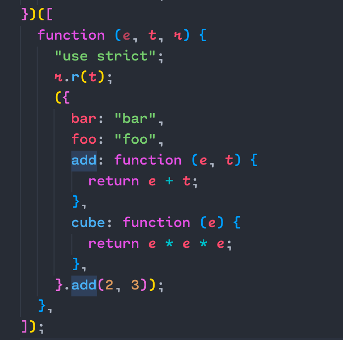

# tree shaking

> 基于 ES Module 规范的 Dead Code Elimination 技术

## 实现的理论基础

ES 模块规范要求所有的导入导出语句只能出现在模块顶层，且导入导出的模块名必须为字符串常量。所以，ESM 下模块之间的依赖关系是确定的，编译工具只需要对 ES Module 做静态分析就可以从代码字面量中推断出模块导出的哪些值未曾被其他模块使用，进而将其标记和删除，以此实现打包产物的优化

## webpack 中的 tree shaking

首先 「标记」 出模块导出值中哪些没有被用过，其次使用 Terser、UglifyJS 等插件删除掉这些没有被用到的导出语句，以此实现完整的 tree shaking 功能

## 实际配置

准备一个 entry.js 和 utils.js

### webpack v4

源码如下：
@[code js](./src/webpack4-treeshaking/enable.js)
打包结果 tree shaking 生效

但当有函数调用时：
@[code js](./src/webpack4-treeshaking/disable.js)
此时的打包结果为：

可以看到，将整个导出的模块代码都打包了进去，包括我们没有用到的 cube 等方法
